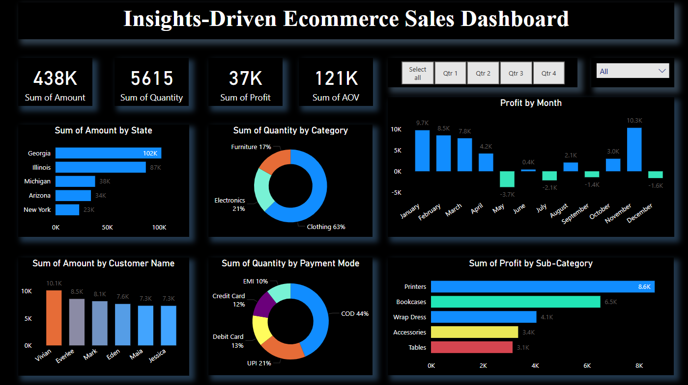

# Insights-Driven Ecommerce Sales Dashboard

## Dashboard Preview

## Overview
This repository contains a PowerBI dashboard created to analyze synthetic ecommerce sales data. The dashboard provides a comprehensive overview of key sales metrics, customer insights, and business performance indicators. It is designed to help businesses make data-driven decisions and improve sales strategies.

## Datasets
### Details.csv
The `Details.csv` file includes detailed transaction-level data with the following columns:
- **Order ID**: Unique identifier for each order.
- **Amount**: The total revenue generated by the order.
- **Profit**: The profit earned from the order.
- **Quantity**: The number of items in the order.
- **Category**: Broad classification of the items in the order.
- **Sub-Category**: Specific classification of the items in the order.
- **PaymentMode**: The mode of payment used by the customer.

### Orders.csv
The `Orders.csv` file contains supplementary data about each order with the following columns:
- **Order ID**: Unique identifier for each order.
- **Order Date**: The date the order was placed.
- **CustomerName**: The name of the customer who placed the order.
- **State**: The state where the order was delivered.
- **City**: The city where the order was delivered.

## Dashboard Features
The dashboard showcases the following key metrics and visualizations:

- **Key Metrics**:
  - **Sum of Amount**: $438K
  - **Sum of Quantity**: 5,615 items
  - **Sum of Profit**: $37K
  - **Sum of AOV**: $121K (Average Order Value, calculated as `Amount / Quantity`)

- **Visualizations**:
  - **Sum of Amount by State**: A bar chart that highlights the total revenue generated by each state, with Georgia leading at $102K.
  - **Sum of Quantity by Category**: A pie chart showing the percentage distribution of sales quantities across categories, including Clothing (63%), Electronics (21%), and Furniture (17%).
  - **Profit by Month**: A bar chart depicting monthly profit trends, with November achieving the highest profit at $10.3K.
  - **Sum of Amount by Customer Name**: A bar chart illustrating the top customers by revenue, with Vivian topping the chart at $10.1K.
  - **Sum of Quantity by Payment Mode**: A pie chart categorizing the proportion of payment modes used, such as COD (44%), UPI (21%), Debit Card (13%), Credit Card (12%), and EMI (10%).
  - **Sum of Profit by Sub-Category**: A bar chart analyzing profitability at the sub-category level, with Printers generating the highest profit at $8.6K.

## Data Insights
- **Top-Performing States**: Georgia leads in total revenue with $102K.
- **Category Contributions**: Clothing dominates with 63% of total sales quantity.
- **Monthly Trends**: November is the most profitable month.
- **Customer Insights**: Vivian is the top customer with the highest total spend.

## Usage
1. Download the `Details.csv` and `Orders.csv` files along with the PowerBI file.
2. Open the PowerBI file in PowerBI Desktop.
3. Ensure the `Details.csv` and `Orders.csv` files are in the same directory as the PowerBI file to avoid connection issues.
4. Explore the dashboard to gain valuable insights.

## Synthetic Data Disclaimer
The datasets used for this dashboard (`Details.csv` and `Orders.csv`) were synthetically generated and do not represent real-world data. They were created specifically for demonstration and analysis purposes.

## Conclusion
The Insights-Driven Ecommerce Sales Dashboard serves as a powerful tool for visualizing and understanding ecommerce performance. Its interactive visualizations and metrics provide valuable insights to optimize sales strategies, improve customer targeting, and enhance overall business outcomes.
